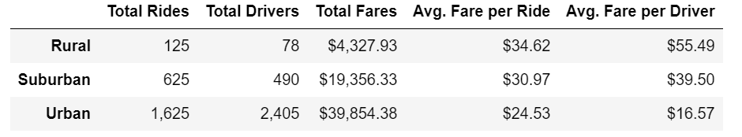
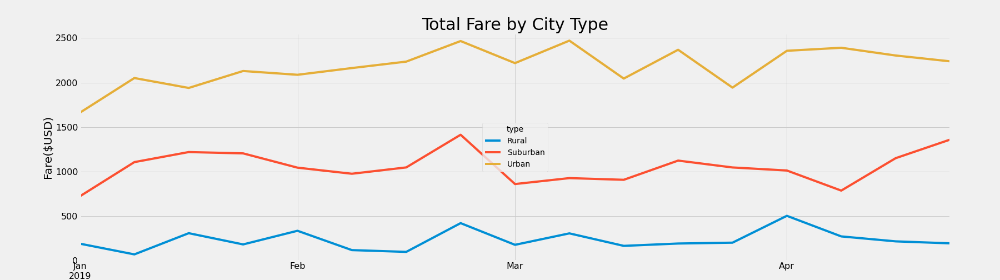

# PyBer Analysis

## Project Overview

In this project we were asked to analyze rideshare data from January to early May of 2019 and create a compelling visualization story for the CEO of PyBer.
To complete this, the following was calculated:

- Average fare per each city type. A bubble chart was used to visualize the data
- Summary statistics per city type (ride count, fares, driver count). Box-and-whisker charts were used to visualize the data
- Percentage of total fares, total rides, and total driver per city type. Pie charts were used to visualize the data

After the completion of the above, the CEO V. Isualize requested a multiple line graph that shows total weekly fares for each city type.

# Purpose 

The purpose of this project is to create a summary DataFrame of the ride-sharing data by city type that allows us to create a multiple line graph that shows total weekly fares for each city type. 
We will use the graphs to explain how the data differs by city type.

## Results

The below screenshot of the Summary DataFrame shows the results for each city type:
 

- Total Number of Rides: total number of rides for urban cities is 2.6 times higher than suburban cities and 13 times higher than rural cities.
- Total Number of Drivers: total number of drivers for urban cities is 4.9 times higher than suburban cities and 30.8 times higher than rural cities.
- Total Fares: Urban cities collected $39.8K, suburban cities collected $19.4K, and rural cities collected $4.3K in total fares.
- Average Fare per Ride: Average fare per ride in urban cities is $6.40 cheaper (21%) than suburban cities, and $10.09 cheaper (29%) than rural cities.
- Average Fare per Driver: Average driver in urban cities collects about 58% less than drivers in suburban cities, and 70% less than drivers in rural cities.

Below is the multiple line graph showing weekly fares by city type:

As expected, urban cities have the highest total amount of fares per week, rural cities have the lowest, and suburban cities fall in between.
All city types tend to follow the same trend, with a peak in total fares the third week of February. The trend for suburban cities differs from urban and rural cities after the second week of April. 

## Summary

Based on the above results, my recommendations are as follow:

1. Look into driver and ride count per capita. The data clearly suggests that there are more drivers and more rides in urban areas. However, it is important to compare total driver count and ride count per X number of habitants.
Without knowing this, is hard to know whether PyBer needs to increase or decrease the number of drivers in certain city types.

2. Look into total fares ($) per miles driven. While the data suggests that is cheaper to ride in Urban areas, we first need to know if the average fare per ride, and average fare per driver is being impacted by short rides in urban areas or long rides in rural areas.

3. Dig into the data to find out what is causing a peak in the third week of February, and why total fares for urban and rural cities decrease while total fares for suburban cities increase.
